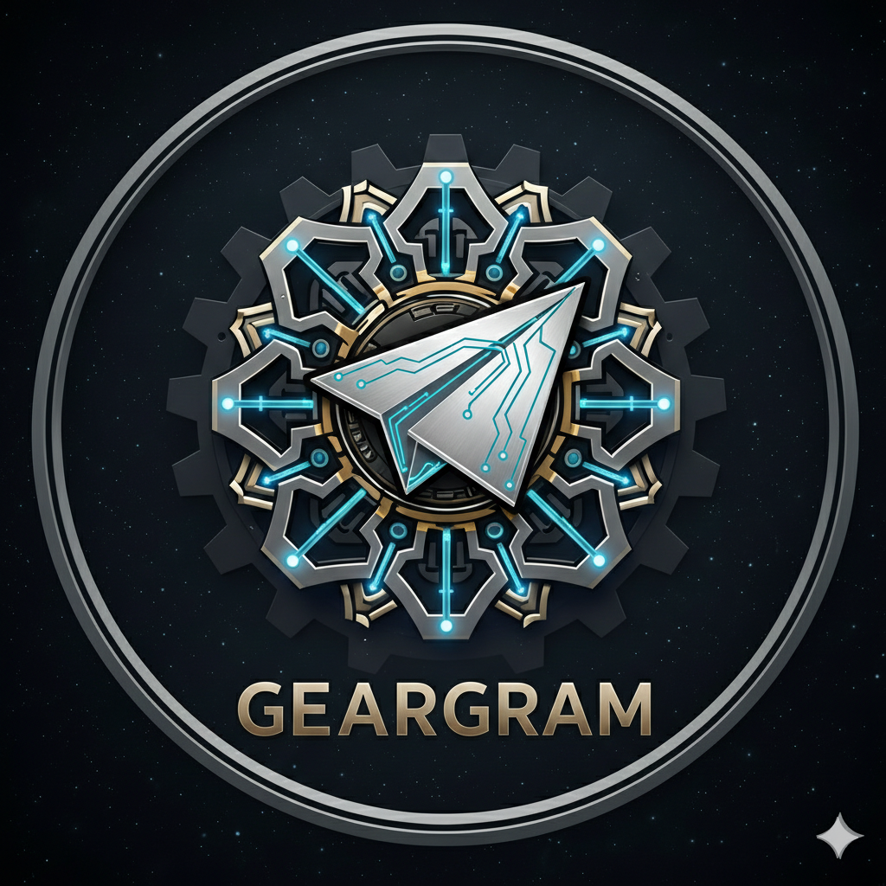
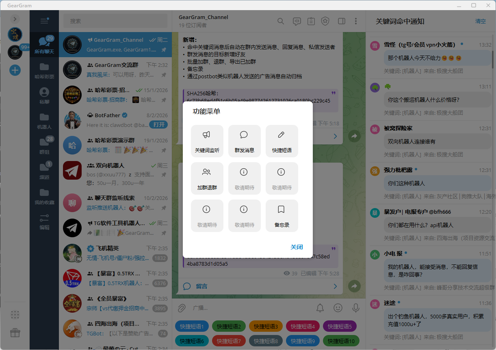
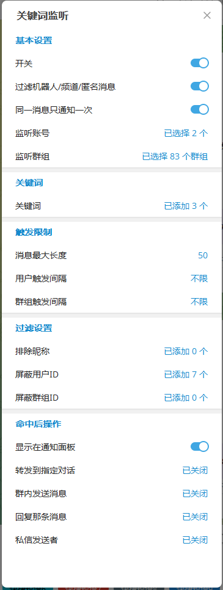
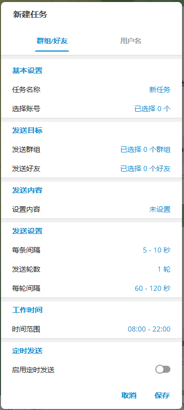
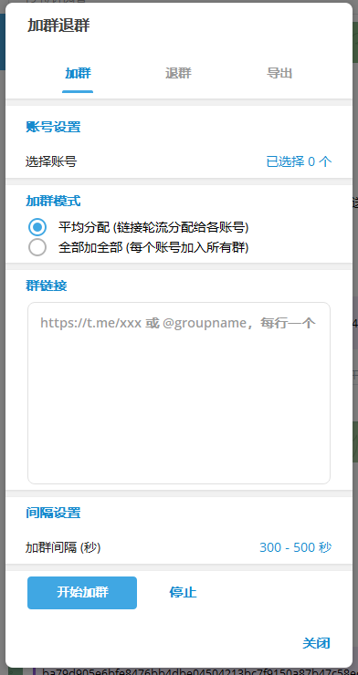

● 

  

  # GearGram Desktop

  **增强版 Telegram 桌面客户端**

  在官方 Telegram Desktop 基础上，增加了丰富的实用功能

  [💬 Telegram 频道](https://t.me/GearGram_Channel) · [👥 Telegram 群组](https://t.me/GearGram_Group)

  

  ---

  ## 📸 界面预览

  | | | |
  |:---:|:---:|:---:|
  |  |  |  |
  |  | | |

  ---

  ## 🚀 功能菜单
  
  ### 支持100个账号登陆
  
  ### 群聊关键词监听
  实时监控指定群组中的关键词消息，支持：
  - 自定义监控群组和关键词列表
  - 命中后自动执行多种操作

  ### 群发消息
  批量发送消息到多个私聊或群组：
  - 支持文本、图片、文件等多种消息类型
  - 支持 Via Bot（内联机器人）方式发送
  - 可设置发送间隔，避免频率限制
  - 支持从联系人列表或群组成员中选择目标

  ### 快捷短语
  预设常用回复模板，一键快速发送：
  - 支持创建多条短语
  - 聊天窗口中快速调用
  - 提高客服和运营效率

  ### 加群退群
  批量管理群组的加入和退出：
  - 通过链接批量加入群组
  - 批量退出不需要的群组
  - 适合多群运营场景

  ### 备忘录
  内置记事本功能，随手记录重要信息。

  ### 文字生成二维码
  ### 数字ID查看
  ### 其他几十项增强功能...
  ---

  ## 📥 下载安装

  1. 前往 [**Releases 页面**](https://github.com/GearGram/GearGram/releases/latest)
  2. 下载 `GearGram.exe`
  3. 直接运行即可，无需安装

  > **系统要求**：Windows 10 / 11 64-bit

  ---

  ## 📞 联系我们

  - **Telegram 频道**：[@GearGram_Channel](https://t.me/GearGram_Channel)
  - **Telegram 群组**：[@GearGram_Group](https://t.me/GearGram_Group)

  ---

  

  **如果觉得好用，请给个 ⭐ Star 支持一下！**

  

